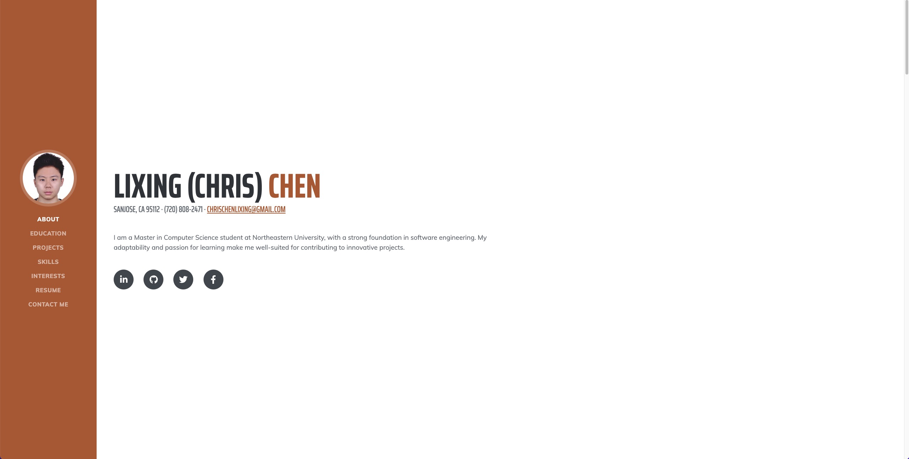

# chrischenlixing.github.io

**Author**: Lixing Chen

## Class Link

[https://johnguerra.co/classes/webDevelopment_fall_2023/]

## Project Objective

The project is for building my home page, which includes my skills, courses, projects and hobbies using HTML, CSS, JavaScript, and Bootstrap.

## Screenshot




## Instructions to Build

1. Clone the repository to your local machine:

   ```bash
   git clone https://github.com/chrischenlixing/chrischenlixing.github.io.git