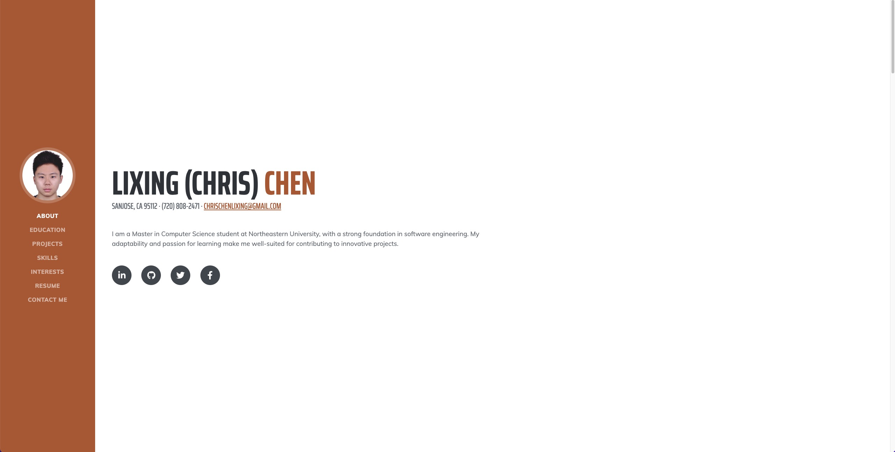

# chrischenlixing.github.io


**Author**: Lixing Chen

## Project Link

[Main Page](https://chrischenlixing.github.io/chrisWebP1/index.html)

## Class Link

[Web Development Class - Fall 2023](https://johnguerra.co/classes/webDevelopment_fall_2023/)


## Project Objective

The project is for building my home page, which includes my skills, courses, projects and hobbies using HTML, CSS, JavaScript, and Bootstrap.

## Screenshot




## Instructions to Build

1. Clone the repository to your local machine:

   ```bash
   git clone https://github.com/chrischenlixing/chrischenlixing.github.io.git


## Video

[Introduction](https://chrischenlixing.github.io/chrisWebP1/index.html)
